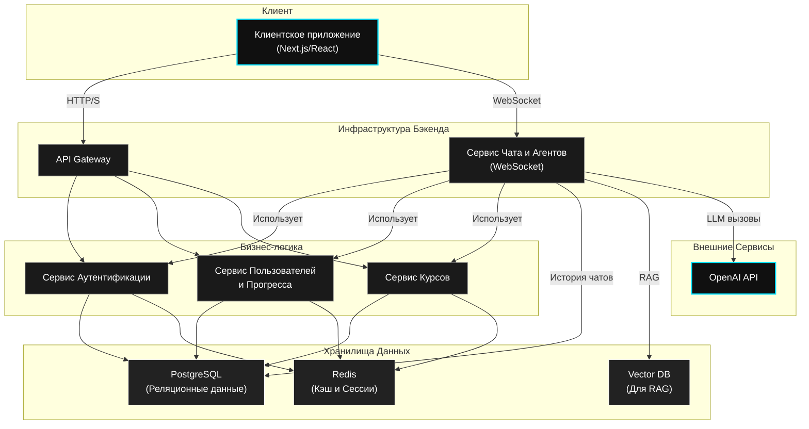

# AI Learning Platform: Backend Architecture

Это репозиторий для AI-платформы обучения, спроектированной вокруг **Agentic UX** и **персонализированных треков**. Документ описывает архитектуру бэкенда, принципы хранения данных и API для взаимодействия с фронтендом.

---

## Ключевые принципы архитектуры

*   **Модульность**: Система разделена на независимые сервисы, каждый из которых отвечает за свою бизнес-логику. Это упрощает разработку, тестирование и развертывание.
*   **Масштабируемость**: Архитектура готова к горизонтальному масштабированию. Сервисы и базы данных могут быть реплицированы для обработки растущей нагрузки.
*   **Гибкость**: Четкое разделение логики и использование абстракций (например, для AI-агентов) позволяет легко заменять или обновлять компоненты без воздействия на всю систему.

---

## Схема архитектуры



---

## Компоненты

### Сервисы

1.  **API Gateway**: Единая точка входа для всех HTTP-запросов. Отвечает за маршрутизацию к внутренним сервисам, аутентификацию по JWT и частичную валидацию.
2.  **Сервис Аутентификации**: Управляет регистрацией, входом, выпуском и валидацией JWT-токенов.
3.  **Сервис Пользователей и Прогресса**: CRUD-операции для пользователей, их настроек (стиль AI) и отслеживания прогресса по курсам.
4.  **Сервис Курсов**: Предоставляет информацию о треках, модулях и уроках.
5.  **Сервис Чата и Агентов**: Ядро AI-логики.
    *   Обрабатывает WebSocket-соединения для real-time общения.
    *   Инкапсулирует логику **агентской архитектуры**.
    *   Управляет памятью диалогов и взаимодействием с OpenAI API.

### Хранилища данных

*   **PostgreSQL**: Основная реляционная база данных для хранения информации о пользователях, курсах, прогрессе и истории диалогов.
*   **Redis**: In-memory хранилище для кэширования часто запрашиваемых данных (профили, детали курсов) и управления сессиями.
*   **Vector DB (план)**: Специализированная база данных (например, ChromaDB, pgvector) для хранения векторов эмбеддингов, что является основой для **RAG (Retrieval-Augmented Generation)**.

---

## Агентская архитектура

Для реализации AI-наставников используется гибкая агентская архитектура.

*   **BaseAgent**: Абстрактный класс, определяющий интерфейс для всех агентов. Включает в себя `run` цикл, `memory` и `tools`.
*   **DashboardAgent**: Агент для главного экрана. Помогает пользователю с навигацией по трекам и отвечает на общие вопросы.
*   **CourseAgent**: Специализированный агент для страницы курса. Имеет доступ к RAG-инструментам для ответов на вопросы по конкретным материалам урока.

---

## API

### REST API (через API Gateway)

*   `POST /api/auth/register`
*   `POST /api/auth/login`
*   `GET /api/users/me` — получение данных профиля (требует JWT).
*   `GET /api/dashboard/tracks` — получение карточек курсов для главного экрана.

### WebSocket API (Сервис Чата)

*   **Endpoint**: `wss://your-domain.com/ws/chat`
*   **Протокол**:
    1.  Клиент подключается, передавая JWT в заголовках.
    2.  Клиент отправляет `init` сообщение с контекстом (`{ "agent": "dashboard" }` или `{ "agent": "course", "course_id": 123 }`).
    3.  Сервер инстанцирует нужного агента и загружает историю.
    4.  Далее происходит обмен `chat_message`.

---

## Локальная разработка

Для запуска бэкенд-инфраструктуры (базы данных и кэш) используется Docker. Файлы `docker-compose.yml` и `Makefile` находятся в корне проекта.

### Требования

*   Docker
*   Docker Compose
*   Make (опционально, для удобства)

### Запуск

1.  **Запуск сервисов из корня проекта**:
    ```bash
    make up
    ```
    Эта команда поднимет контейнеры с PostgreSQL и Redis в фоновом режиме.

2.  **Остановка сервисов из корня проекта**:
    ```bash
    make down
    ```

### Конфигурация

*   **PostgreSQL**: Доступен по `localhost:5432`. Креды: `user` / `password`, база данных: `animal_db`.
*   **Redis**: Доступен по `localhost:6379`.
*   **Переменные окружения**: Скопируйте `backend/.env.example` в `backend/.env` и заполните необходимые значения (API-ключи и т.д.). 